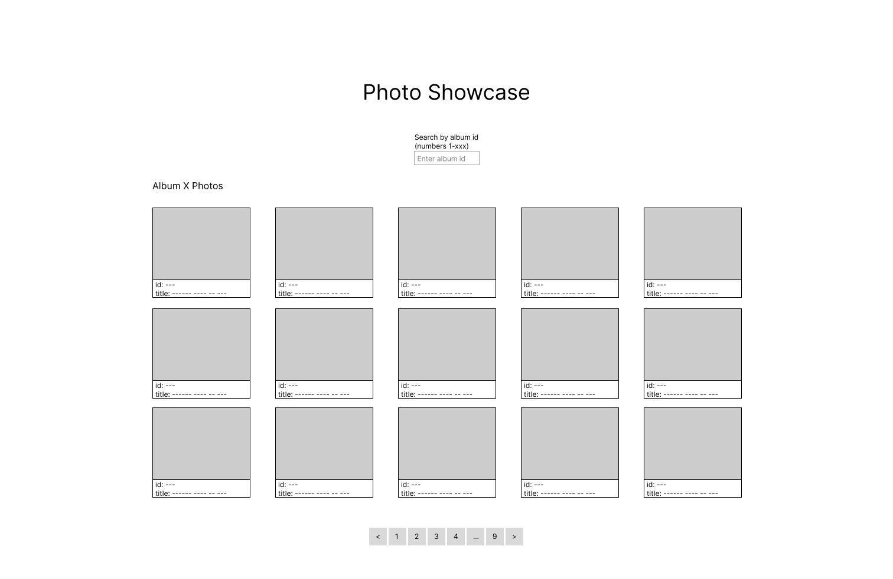
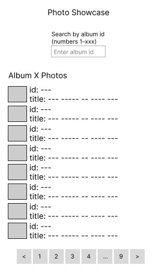

# Photo Showcase

This project is a React application to display and search for photos by a photo album id.

You can view a live version of the application [here](https://jreich5.github.io/photo-showcase/).

[This GitHub project board](https://github.com/users/jreich5/projects/3) was used to organize the development of this application. More details on project, the development process, and how to run the project locally are included below.

## Table of Contents

- [Description](#description)
- [Setup](#setup)
- [Development Process](#development-process)
- [Lessons Learned](#lessons-learned)

## Description (IN PROGRESS)

## Setup (IN PROGRESS)

## Development Process (IN PROGRESS)

### Inital Setup and Planning

I started started this project by first building out a <10min prototype in a single HTML file with JavaScript. This early prototype in the root of the project is the file called `ten-minute-prototype.html`. I did this to get a quick sense of the basic functionality of the project.

After completing the prototype, I decided to build out a front-end app using React+TypeScript with Vite and Bun. My goal with this build was to strike a balance between over-engineering and adhering to as many best practices as possible.

I prioritized the following considerations:

1. Comprehensive test coverage
1. Code clarity
1. Performance

After first setting up the project and removing the boilerplate code, I pushed the starting code up to a new GitHub repository and populated a GitHub Project board with tasks for completing the showcase.

I then created mockups with Figma for the desktop and mobile views.

Desktop mockup:

Mobile mockup:

### TDD Development

## Lessons Learned (IN PROGRESS)
